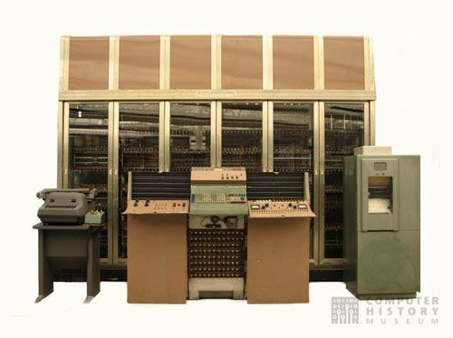

<h1>Симулятор Johniac</h1>

Содержимое памяти задается и выводится в текстовый файл. Необходимо обеспечить возможность имитации работы ЭВМ до ее останова или в течение заданного числа шагов. Необходимо обеспечить возможность отладки машины (вывод содержимого памяти и регистров, возобновление работы машины). Обратить внимание: допускается имитация любого варианта Johniac’а.
 

Базовый вариант задания имитация гипотетической машины, описанной в классической работе «Preliminary discussion of the logical design of an electronic computing instrument»

